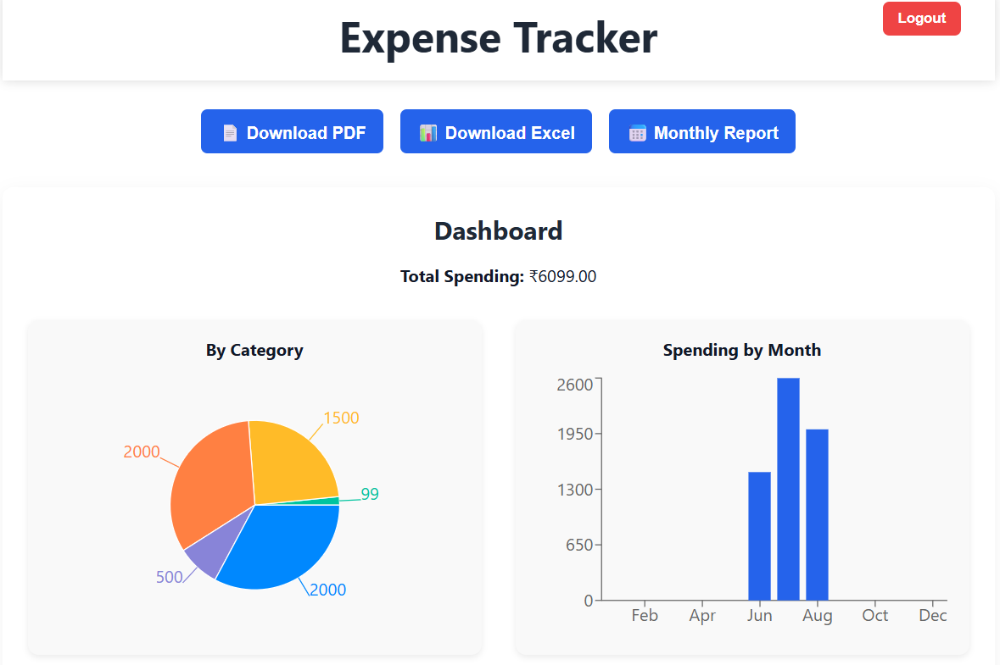
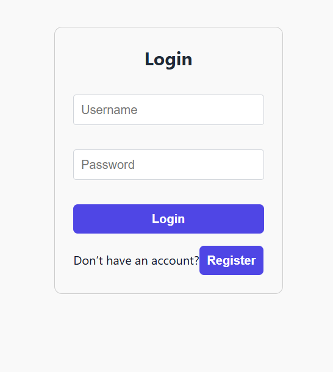
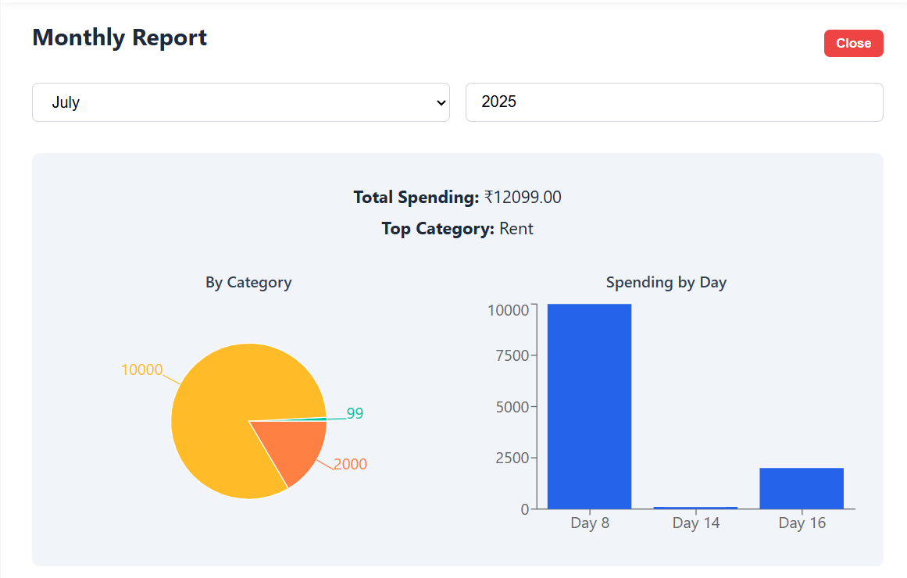

# 💸 Expense Tracker App

A modern, responsive full-stack Expense Tracker application built with **React.js** and **Node.js (Express)**. Easily manage your personal expenses, view insightful dashboards, generate reports in **PDF/Excel**, and visualize spending trends with interactive charts.

---

## 📸 Screenshots





> ℹ️ Place screenshots in the `screenshots/` folder in your repo.

---

## 🧰 Tech Stack

| Frontend         | Backend             | Database      | Charts & Exports             |
|------------------|---------------------|----------------|-------------------------------|
| React.js (Vite)  | Node.js + Express.js | MongoDB (Mongoose) | Recharts, jsPDF, SheetJS (xlsx) |

---

## ✅ Features

- 🔐 User Registration & Login (with token-based auth)
- ➕ Add new expenses with description, category, date/time
- 📄 Export reports to **PDF** and **Excel**
- 📊 Monthly and Category-wise breakdown via charts (Pie + Bar)
- 🧠 Real-time dashboard with total expenses and trends
- 🔎 Filter by month and year for focused reports
- 🔁 Smooth transitions between login and register
- 📱 Responsive and mobile-friendly
- 🖼️ Avatar + logout on top-right with sticky header

---

## 🚀 Getting Started

### ⚙️ Prerequisites

- Node.js (v16+)
- MongoDB installed locally or use MongoDB Atlas
- npm / yarn

---

### 🖥️ Clone the repository

```bash
git clone https://github.com/SkJishan04/expense-tracker-app.git
cd expense-tracker-app


### 📦 Install Dependencies

#### 1. Frontend

```bash
cd client
npm install
```

#### 2. Backend

```bash
cd ../server
npm install
```

---

### 🔐 Environment Setup

Create a `.env` file in the `/server` directory:

```env
PORT=5000
MONGO_URI=your_mongodb_connection_string
JWT_SECRET=your_super_secret_key
```

---

### ▶️ Run the App

#### 1. Start Backend Server

```bash
cd server
npm start
```

#### 2. Start Frontend React App

```bash
cd client
npm run dev
```

Your app will now run at:
📍 **[http://localhost:5173](http://localhost:5173)**

---

## 📂 Project Structure

```
expense-tracker-app/
├── client/
│   ├── components/
│   ├── pages/
│   ├── App.jsx
│   ├── App.css
│   └── ...
├── server/
│   ├── models/
│   ├── routes/
│   ├── controllers/
│   └── server.js
└── README.md
```

---

## 👨‍💻 Contributing

Pull requests are welcome! Follow these steps:

1. Fork the project
2. Create a new branch (`git checkout -b feature-name`)
3. Commit your changes (`git commit -m "Add feature"`)
4. Push to the branch (`git push origin feature-name`)
5. Open a pull request

---

## 🛡️ License

This project is licensed under the **MIT License** — see the [LICENSE](LICENSE) file for details.

---

## 📬 Contact

If you have any feedback, issues, or feature requests:

* 📧 Email: [skjishan28012004@gmail.com](mailto:skjishan28012004@gmail.com)
* 🐦 LinkedIn: [Sk. Jishan](https://www.linkedin.com/in/sk-jishan-795127256/)
---
